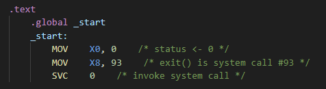
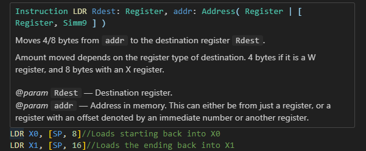
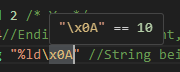
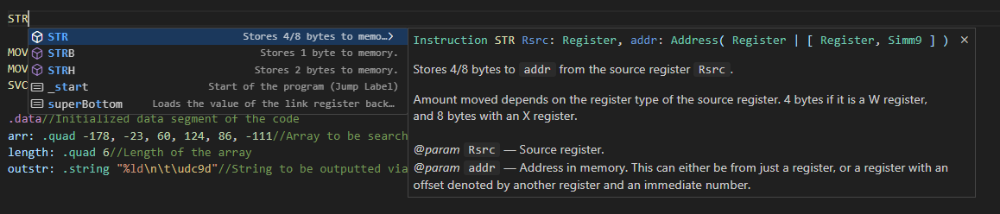
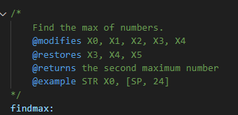
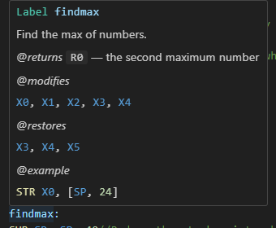

# Arm Assembly Helpers <!-- omit in toc -->
*By Joshua Bernstein*
This is an extension to add syntax highlighting and instruction definitions for Armv8 assembly language. This extension is still very much a WIP. If you find any issues or bugs, please report them on the GitHub [here](https://github.com/joshbernsteint/arm_helpers), and I will try to resolve it quickly.

- [Features](#features)
  - [Syntax Highlighting](#syntax-highlighting)
  - [Instruction Definitions](#instruction-definitions)
  - [Auto Completion](#auto-completion)
  - [Memory Label Docstrings](#memory-label-docstrings)
  - [Pre-made code snippets](#pre-made-code-snippets)
  - [Macro Commands](#macro-commands)
- [FAQ](#faq)
- [Contributing](#contributing)

## Features

### Syntax Highlighting
   
This extension comes with full syntax highlighting support for VSCode. 
* Instructions (such as Add, Sub, Mov, etc...) are colored like functions in higher-level languages. 
* Registers are colored as constants, and labels are colored as variables. 
* Directives that indicate sections of the file (like `.text`) or declaring symbols (like `.extern` or `.global`) are colored as keywords.
* Directives that declare memory space (such as `.quad` or `.string`) are colored as a Type declaration (such as the result of using typedef in C).
* Comments and strings are colored exactly like other languages.

### Instruction Definitions
By hovering over any instruction, you will be able to see its definition. This consits of how to call it, its operands, and what it does.   
    
In the above image, by hovering over the `LDR` instruction, you can view how to call it and its operands via the first line. In this case, it takes a register as its first operand and an address for its second. This address can either be from just a register or from a register and signed 9-bit immediate number in brackets. Moreover, there is a brief description of what the instruction actually does, as well as describing its operands in greater detail. 

Many ARMv8 instructions are currently supported with this feature, but **not** all of them. If you have any requests please create an Issue on the GitHub.

This feature extends to non-instructions as well. Some directives also have this feature, where by hovering over them you get general information about it. Also, by hovering over escaped sequences in strings, you will be able to view their value as a decimal number. This feature is very dynamic and should work for any valid escape sequence.

   
In the image above I write a newline character in its hex form (instead of `\n`), and it converts the hex number into decimal. It would also work as a normal newline character, or other escape sequences like (but not limited to) `\r, \t, \0`.

### Auto Completion
Supported instructions and labels will apper with an autocomplete if VSCode thinks you are trying to type it.
    
By selecting the instruction (with the arrow keys) you can also view the instruction definitions. As you can see, user-declared labels like `_start` also appear in the autocomplete. Additionally, the brief descriptions you see are sourced from comments in the code file itself. You can read more about commenting labels in the next section about docstrings. If you select an autocomplete, it will create the empty spaces in the file meant for the operands and you can move through each operand by pressing `TAB`.

### Memory Label Docstrings

In addition to inline comments and above-line comments to describe labels, you can also use docstrings akin to higher-level languages. These are created by using `/* */` comments directly above a label declaration. You can view these docstrings by hovering over the label at any point of the code. Below are listed the type of docstring tags you can use. All of these tags are optional, and just having regular words with no tags will also create a docstring.    

| Tag  | Example |     Description   |
| :------:      | ------- |  -----            |
| @param  |`@param First Operand`|     Declares a parameter for the label. Since there are no "variables", parameters are assumed to be registers. As a result, you don't need to declare their name (unlike other languages).                |
| @returns |`@returns The square of the parameter`| Describes what the procedure returns. Having multiple return tags indicates that registers other than X0 are being returned.                 |
| @modifies |`@modifies X0, X1, X2, X3, X30`| Indicates what registers are being modified by the procedure. This means that the value of these registers may not be the same after procedure finishes.                  |
| @restores |`@restores X30`| The opposite of the `@modifies` tag, indicating which registers are restored to their state before the procedure executed.                 |
| @example |`@example [example code]`|   This tag describes a block of code demonstrating an example. This example can be multiline, and captures until there is another tag or the docstring ends.                |

    

   
*Above: An image of a valid docstring in the code, and how it looks rendered while hovering.*    

### Pre-made code snippets
There are default snippet statements you can use to expedite coding.
* Using the `basic` snippet will create the simplest valid assembly program. It just enters and immediately exits.
* Using the `exit` snippet will add the exit protocol.
* The `repeat` snippet will add the `.rept` directive. It also aligns the cursor to select the number of repitions, the "type" directive, and the value to be repeated.

### Macro Commands
Sometimes pre-made snippets just aren't enough. As a result, this extension also has macro abbreviations built in. If you have used HTML before in VSCode, they are similar to Emmet Abbreviations. By typing the macro symbol `@` followed by the arguments. As of now, here are the usable macros:

|                  Format                  |   Example  | Description                                                                                                                                                                                        |
|:----------------------------------------:|:----------:|----------------------------------------------------------------------------------------------------------------------------------------------------------------------------------------------------|
| `@[Integer]`                      | `@32`      | Allocates [Number] amount of bytes onto the stack. At the same time, saving the link register onto the stack.                                                                                      |
| `@[Letters or Numbers]:[Integer]` | `@test:32` | Declares the label defined by the sequence of letters and numbers before the semicolon. It then allocates [Number] amount of bytes onto the stack. It also saves the link register onto the stack. |
|  `@[Register]['r'?]-[Register or Integer]`                                        |  `@X0-X9`           |   Creates a loop from the first register to the endpoint. This endpoint can either be in the form of a register or a static integer value. In the case of the optional 'r' flag being used, the source register will be set to 0 before the loop starts.                                                                                                                                                                                   |

## FAQ
> Will you add more instruction definitions?
  * Yeah
> Why would you do this?
  * Idk
## Contributing
You can make pull requests on the github. 
